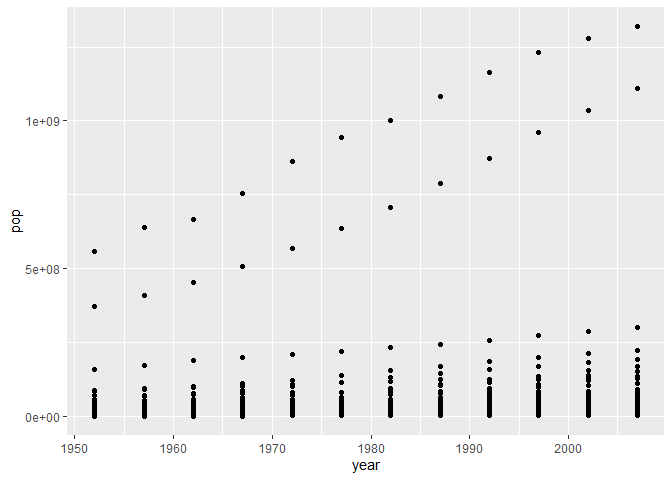
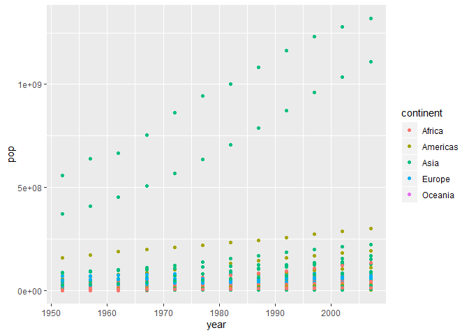
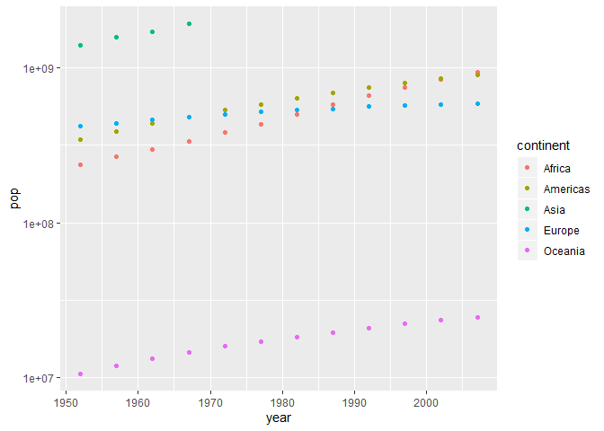
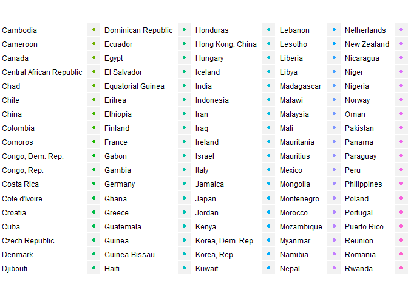
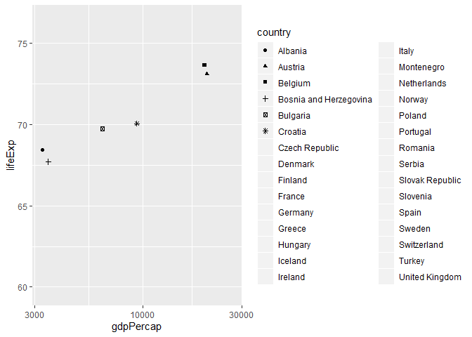
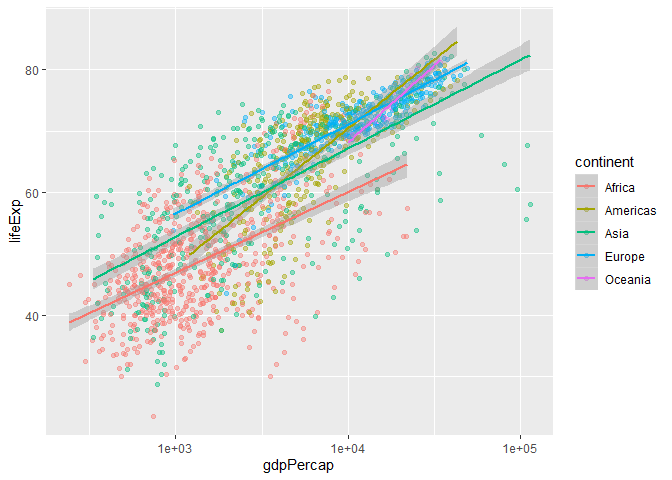
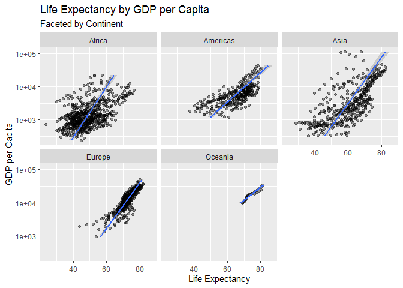
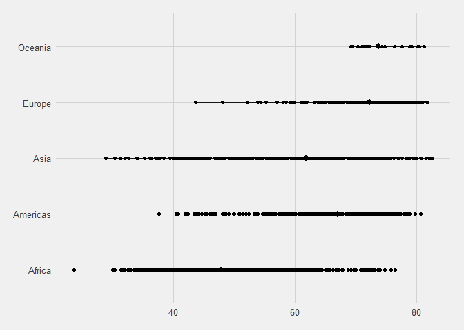

``` r
#install.packages("gapminder") # Features the dataset used in class
library(gapminder)
```

    ## Warning: package 'gapminder' was built under R version 3.6.2

``` r
library(tidyverse)
```

    ## -- Attaching packages ---------------------------------------------------------------------------------------------------------- tidyverse 1.2.1 --

    ## v ggplot2 3.2.1     v purrr   0.3.2
    ## v tibble  2.1.3     v dplyr   0.8.3
    ## v tidyr   0.8.3     v stringr 1.4.0
    ## v readr   1.3.1     v forcats 0.4.0

    ## -- Conflicts ------------------------------------------------------------------------------------------------------------- tidyverse_conflicts() --
    ## x dplyr::filter() masks stats::filter()
    ## x dplyr::lag()    masks stats::lag()

``` r
#install.packages("ggthemes")
library(ggthemes)
```

    ## Warning: package 'ggthemes' was built under R version 3.6.2

Let’s get the data ready

``` r
# Data and aesthetic mapping: Have an x and y variable; matched to  an x and y coordinate; can add numerous levels.

data("gapminder")

str(gapminder)
```

    ## Classes 'tbl_df', 'tbl' and 'data.frame':    1704 obs. of  6 variables:
    ##  $ country  : Factor w/ 142 levels "Afghanistan",..: 1 1 1 1 1 1 1 1 1 1 ...
    ##  $ continent: Factor w/ 5 levels "Africa","Americas",..: 3 3 3 3 3 3 3 3 3 3 ...
    ##  $ year     : int  1952 1957 1962 1967 1972 1977 1982 1987 1992 1997 ...
    ##  $ lifeExp  : num  28.8 30.3 32 34 36.1 ...
    ##  $ pop      : int  8425333 9240934 10267083 11537966 13079460 14880372 12881816 13867957 16317921 22227415 ...
    ##  $ gdpPercap: num  779 821 853 836 740 ...

``` r
# ggplot2::aes() # This references the package being used for the function without loading the library.
# Order in which you library can affect which function takes precedence.
```

``` r
# data, mapping, aes... all start laying out the coordinates.
ggplot(data = gapminder, mapping = aes(x = year, y = pop)) + 
  geom_point()
```

<!-- -->

``` r
# options(scipen = 999): changing the notation
# can opt to use ggplot() + geom_point(data = x)... or ggplot(data = x) + geom_point()

ggplot() + 
  geom_point(data = gapminder, mapping = aes(x = year, y = pop, color = continent))
```

<!-- -->

``` r
# color = continent WITHIN the aes function... coloring by continent
```

Aggregate by continent.

``` r
gapminder %>%
  group_by(year, continent) %>%
  summarise(pop = sum(pop)) %>%
ggplot(data = ., mapping = aes(x = year, y = pop, color = continent)) + 
  geom_point() + 
  scale_y_log10()
```

    ## Warning in summarise_impl(.data, dots, environment(), caller_env()):
    ## integer overflow - use sum(as.numeric(.))
    
    ## Warning in summarise_impl(.data, dots, environment(), caller_env()):
    ## integer overflow - use sum(as.numeric(.))
    
    ## Warning in summarise_impl(.data, dots, environment(), caller_env()):
    ## integer overflow - use sum(as.numeric(.))
    
    ## Warning in summarise_impl(.data, dots, environment(), caller_env()):
    ## integer overflow - use sum(as.numeric(.))
    
    ## Warning in summarise_impl(.data, dots, environment(), caller_env()):
    ## integer overflow - use sum(as.numeric(.))
    
    ## Warning in summarise_impl(.data, dots, environment(), caller_env()):
    ## integer overflow - use sum(as.numeric(.))
    
    ## Warning in summarise_impl(.data, dots, environment(), caller_env()):
    ## integer overflow - use sum(as.numeric(.))
    
    ## Warning in summarise_impl(.data, dots, environment(), caller_env()):
    ## integer overflow - use sum(as.numeric(.))

    ## Warning: Removed 8 rows containing missing values (geom_point).

<!-- -->

``` r
gapminder %>%
  filter(continent == "Asia") %>%
  ggplot(data = gapminder, mapping = aes(x = year, y = gdpPercap, color = country)) + 
  geom_point() + 
  facet_wrap(~continent)
```

<!-- -->

``` r
# facet_grid allows you to facet on two variables (e.g. year and continent; country and continent)
# facet_wrap: only need to specify one
```

Try two numeric values.

``` r
# this is useless
gapminder %>%
  filter(continent == "Europe") %>%
  group_by(country) %>%
  summarise(gdpPercap = mean(gdpPercap),
            lifeExp = mean(lifeExp)) %>%
ggplot(data = ., aes(x = gdpPercap, y = lifeExp, shape = country)) + 
  geom_point() + 
  scale_x_log10() + 
  stat_smooth(method = lm) 
```

    ## Warning: The shape palette can deal with a maximum of 6 discrete values
    ## because more than 6 becomes difficult to discriminate; you have
    ## 30. Consider specifying shapes manually if you must have them.

    ## Warning: Removed 24 rows containing missing values (geom_point).

<!-- -->

``` r
# scale_x_log10() is taking a log of the x axis; helps us scale the plot values; easier to read
# stat_smooth() will add a smoothed line; shaded areas are the standard error. Uses a LOESS smoother.
## method = lm... makes it a linear trend.
# size = pop... change the size of the data points relative to bin it's trying to describe (e.g. 1000, 10000, 100000, etc.)
# shape = country... maps different shapes for each country data point.
```

Back to square one

``` r
ggplot(data = gapminder, aes(x = gdpPercap, y = lifeExp)) + 
  geom_point(aes(color = continent), alpha = .4) + 
  scale_x_log10() + 
  stat_smooth(method = lm, mapping = aes(color = continent))
```

<!-- -->

``` r
# if you feel there is too much noise with the points just remove geom_point()
# line_type... changes the type of the line
# specified the line type to be continent... by adding it in the geom_point it puts it back to the right line.
# if you put alpha into the aes; it thinks you want to group by that [hence why .3 showed up in the legend]
## however, if you put alpha into geom_point, you can control the hue of the points.

ggplot(data = gapminder, aes(x = gdpPercap, y = lifeExp)) + 
  geom_point(alpha = .4) + 
  scale_x_log10() + 
  stat_smooth(method = lm) + 
  facet_wrap(~continent) + 
  xlab("GDP per Capita") + 
  ylab("Life Expectancy") + 
  ggtitle("Life Expectancy by GDP per Capita", subtitle = "Faceted by Continent") + 
  coord_flip()
```

<!-- -->

``` r
# in this example, facet_wrap(~continent) is faceting by all of the continents
# coord_flip() flips the coordinates
```

Getting weird again

``` r
gapminder %>%
ggplot(data = ., mapping = aes(x = continent, y = lifeExp)) + 
  stat_summary(fun.ymin = min,
               fun.ymax = max,
               fun.y = median,
               alpha = .9) + 
  geom_point() + 
  coord_flip() + 
  theme_fivethirtyeight()
```

<!-- -->
